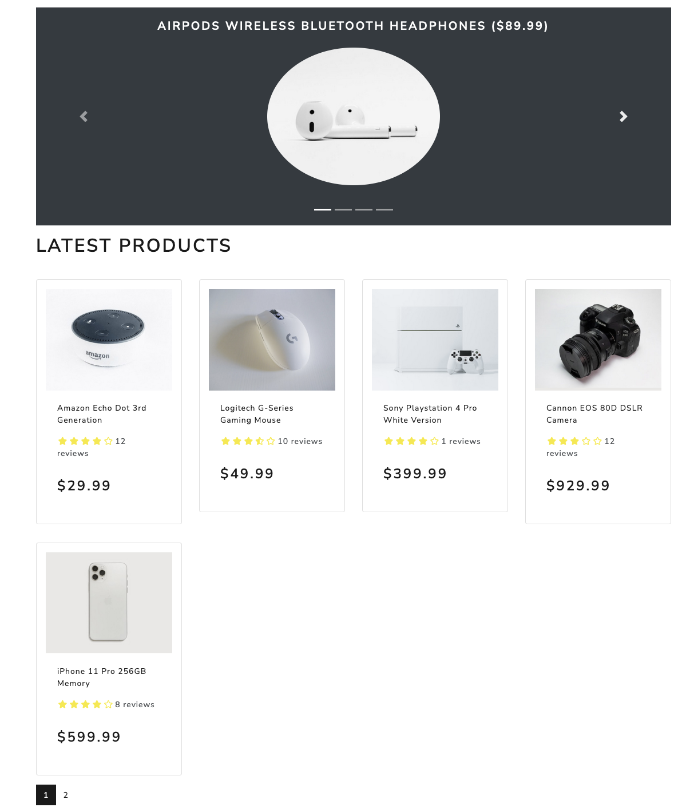
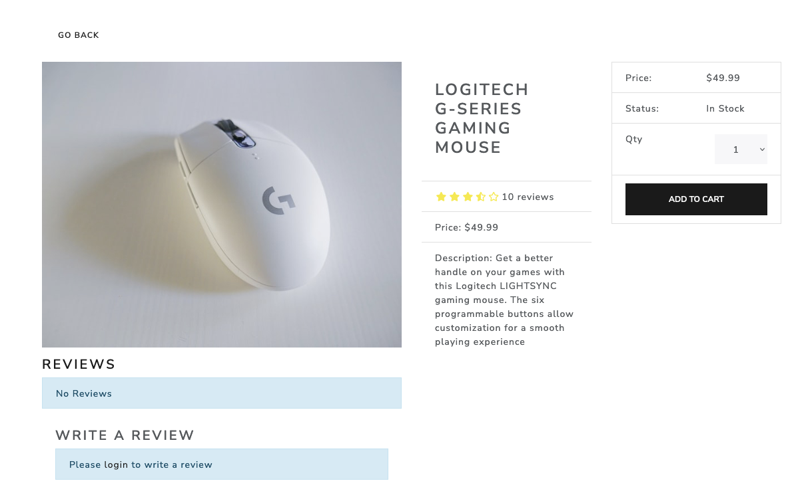
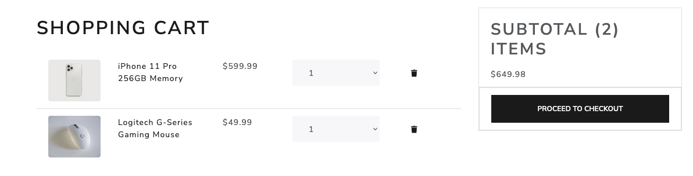
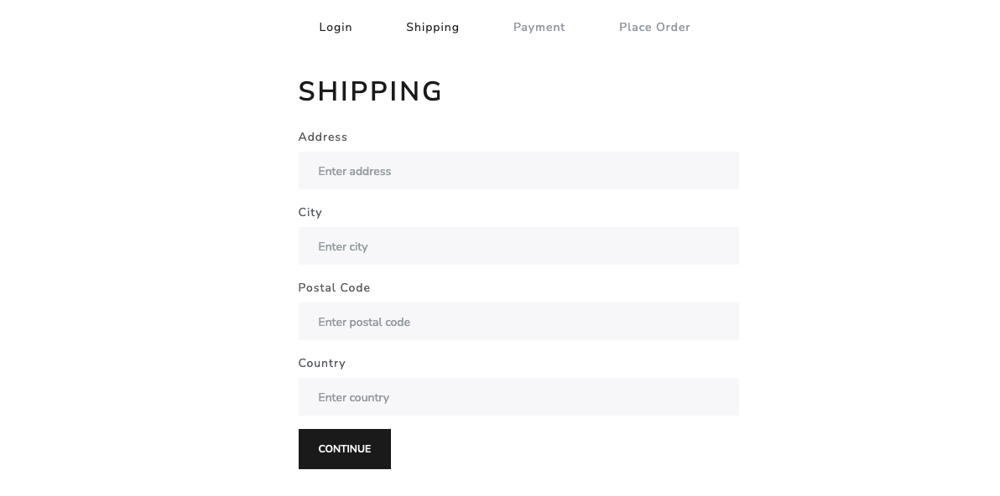
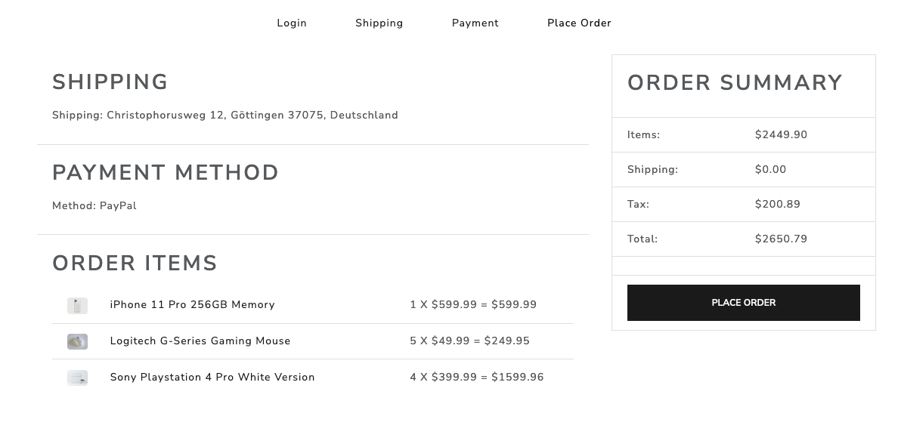
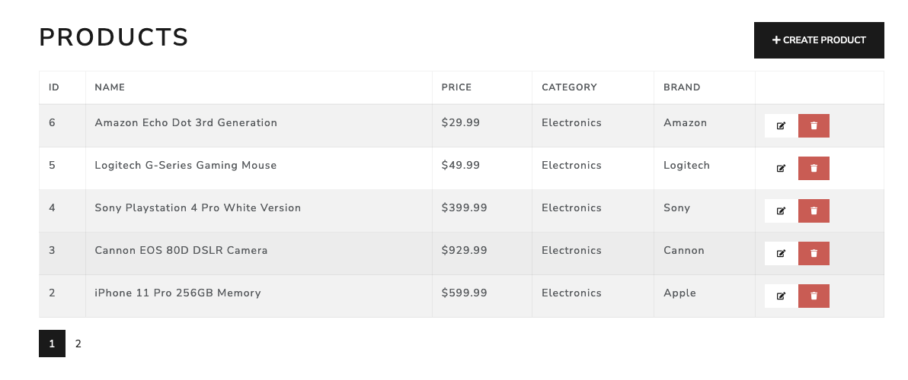

# Ecommerce Website With Django + React + Postgresql

# Download & Setup Instructions

* 1 - Clone project: git clone https://github.com/paul385mi/reactDjango.git
* 2 - cd proshop_django
* 3 - Create virtual environment: virtualenv myenv
* 4 - source myenv/bin/activate
* 5 - pip install -r requirements.txt
* 6 - python manage.py runserver

